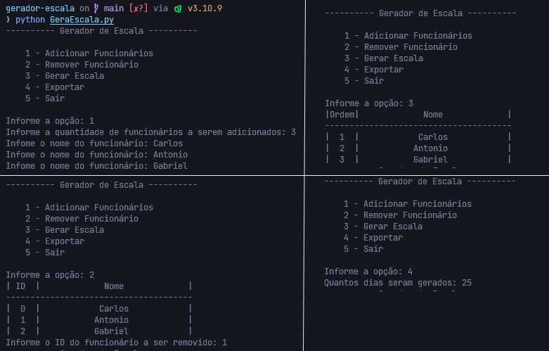

<h1 align="center">
  
  Bem Vindo ao Gerador de Escala
</h1>

<p align="center">
Gerador de escala em _Python_, com opções de <strong>entrada</strong> e <strong>remoção</strong> de participantes, <strong>sorteio</strong> e <strong>exportação</strong> em arquivo CSV com escolha do usuário sobre o tempo em dias, removendo sábados e domingos automaticamente.
</p>

<div align="center">
  
</div>

<br />

<p align="center">
  
  <a href="#" target="_blank">
    
  </a>
  <a href="https://twitter.com/Wesley_AllanS" target="_blank">
    
  </a>
</p>

## 📨 Instalação

Por se tratar de uma linguagem interpretada basta clonar o repositório no Github.

```sh
git clone https://github.com/wesleyallan/geradorescala
```

## ⚙️ Executar

Com **Python** instalado na maquina, basta acessar a pasta e iniciar com o interpretador do python e navegador pelo menu da aplicação.

```sh
cd geradorescala
python GeraEscala.py
```

## Autor

👤 **Wesley Silva**

- Website: [wesleyallan.dev](https://wesleyallan.dev)
- Twitter: [@Wesley_AllanS](https://twitter.com/Wesley_AllanS)
- Github: [@wesleyallan](https://github.com/wesleyallan)
- LinkedIn: [@wesleyallan](https://linkedin.com/in/wesleyallan)

## Mostre seu apoio

Dê um ⭐️ se esse projeto te ajudou!
